# veeam-automated-disaster-recovery

Disaster recovery is important since being able to recover from a disaster is important so that no data or saves are lost in the event of a disaster where important information that is priceless is lost

# Setup
This will require two computers this a main computer running VMWare and a second computer acting as a backup for disaster recovery. 
Start by on the first computer going to Settings -> Network -> Wi-Fi and click on properties and see this part: 
  
Click on edit and be presented with the edit network IP settings pop up and change it from automatic to manual and select the option of IPv4 and see this:  

Put this for the boxes ->   
IP: 192.168.1.10    
Subnet: 255.255.255.0   
Gateway: 192.168.1.1    
DNS: 192.168.1.1 or 8.8.8.8 
Then go to a second computer, can be Linux and go to Network and find the similar Wifi network by going to the search menu and find Network, click on settings icon for Wi-FI and in the pop up select IPv4 and see this screen:
    
Then enter this information ->
IP: 192.168.1.20    
Subnet: 255.255.255.0   
Gateway: 192.168.1.1    
DNS: 192.168.1.1    

If 192 doesn't work, then on Linux type ip addr to see Wi-Fi address, then hostname -I to get route along with ip route to see what the route is, likely will depend on what your router setup is.  
In this instance lets change it to, on Linux, to this:  
IP: 10.0.0.20   
Mask: 255.255.255.0 
Gateway: 10.0.0.1   
DNS: 10.0.0.1   
Then type nmcli connection show to see available networks, then type these commands:    
nmcli connection modify "Wi-Fi Name" ipv4.addresses 10.0.0.20/24    
nmcli connection modify "Wi-Fi Name" ipv4.gateway 10.0.0.1  
nmcli connection modify "Wi-Fi Name" ipv4.dns "10.0.0.1"    
nmcli connection modify "Wi-Fi Name" ipv4.method manual 
nmcli connection up "Wi-Fi Name".   
Last command should reset it and get it back up again.  
Then on Windows do this:    
IP: 10.0.0.10   
Mask: 255.255.255.0 
Gateway: 10.0.0.1   
DNS: 10.0.0.1   
Then on the Windows computer, go to Windows Defender Firewall and click on Advanced settings on the left:   
    
Then scroll down till you see File and Printer Sharing and find the private one and right click on it and click on enable rule: 
  
Then go to the Linux computer and ping the Windows computer
  
Then on the Linux computer go to the command line and type sudo apt install samba -y, then type sudo ufw status to see the status, if off, type sudo ufw enable and rerun to see it if turned on. Next type sudo ufw allow 445/tcp, then type sudo ufw allow samba, then sudo ufw reload to reload and check the ufw status once again: 
  
Then type mkdir -p ~/VeeamBackups to create the directory and type sudo nano /etc/samba/smb.conf after getting into it. 
Then scroll all the way down to the end of the smb.conf file and add this:  
    
Then save it and in the command line type sudo smbpasswd -a your-username   
sudo systemctl restart smbd 
sudo systemctl enable smbd
Then go to the Windows computer in the file folder and type \\10.0.0.20\VeeamBackups here:  
    
Then press enter and a login should pop up. Type in your Linux user and SMB password and should end up here:    
  
Then go to VMWare Workstation and create a Proxmox VM in it by going into VMWare and click on file and clicking on new virtual machine and go through the setup such as Debian 12 64 bit for Guest OS, name of Proxmox VE, give it 8192 MB for memory, bridged adapter for network and 100 GB for the disk and click on create. 
Then go to settings -> Proccessors and enable the Virtualize Intel VT-x/EPT or AMD-V/RVI like below:    
  
Then power on the VM and get it set up. If it doesn't work in VMWare, get it setup in VirtualBox and then go to go the Command prompt and type cd "C:\Program Files\Oracle\VirtualBox" and then type .\VBoxManage.exe modifyvm "Proxmox VE" --nested-hw-virt on and should enable Nested Virtualization.    
Then for the network in Proxmox:    
    
Then wait for a few minutes to set it up and take note of the IP address and enter in into your browser and login with root and the password set:   
    
Next go download a Ubuntu Server VM from: https://ubuntu.com/download/server    
Then for the VM we will be working with go to local (pve) and click on ISO image and click on upload and find the Ubuntu Server ISO that was downloaded and click on upload and wait for a few minutes for the transfer to occur:   
    
Then click on the Create VM blue button in the right corner to create the Linux VM. 
Linux VM:   
Name: Test-Lab  
RAM: 8142 MB    
CPU: 2 Cores    
Disk: 50 GB 
Network: vmbr0  
Then when done make sure to turn off KVM hardware virtualization since it isn't Windows 11. Good configuration for it:  
  
    
Then click on start and wait for it initialize. 
After waiting for a few minutes, you will reach this:   
  
Then go through the process of the steps of getting everything set up, then choose a name, server name, username and password. Then wait for it to finish setting up which will likely take a while:    
    
Then on the second computer's end, go to VirtualBox and create a VM.    
First download Windows Server from this link, either 2019 or 2022 will do: https://www.microsoft.com/en-us/evalcenter/evaluate-windows-server-2019. 
For the VM: 
Name: WinServer-Veeam   
Memory: 4046 MB
2 Processors    
EFI Enabled 
Bridged Adapter for Adapter 1   
80 GB for the disk and dynamic. 
Next get the VM up and running to get the Server on the second computer up  
In the VM on the Windows setup, choose the option of Windows Server 2019 edition desktop like so:   
  
Then click on custom install which will take you to the disk space that was allocated and click on it and next which will take you to the installation screen:  
    
Then wait a while for it to get up and install. 
After waiting a while, this screen will pop up: 
    
Then set the admin password and hit finish and login to the Windows Server VM   
    
Then open up a browser in the VM and download Edge or Chrome to not use Internet Explorer, then go to veeam.com/downloads to get Veeam Backup & Replication Community Edition or if downloaded previously, find the email and download from there and wait around 30-45 minutes for it to finish.   
After waiting a while, it will have downloaded and then right click on the ISO download 
 
Then click on mount to mount the iso and see this afterwards    
  
Then click on setup and have it run which will have a popup to click next with this next:   
    
Click on the first one and wait for it to initalize and click on accept for the license agreement, click on next on license screen and leave alone which will come up with a system configuration check screen and wait a while.    
After waiting a while, this screen will pop up: 
  
Click on next which you take you to this screen:    
    
Clcik on next going through the screens and if it asks about tight disk space, select yes and continue and click install when there and see this screen:    
  
With it installing, it will be a while for it to get set up.    
After a while, this will pop up:    
   
Keep on clicking on retry or cancel until this pops up: 
    
Click on click here to open this folder for it: 
  
Then run the service command to see what ones are not running:  
  
  
Then go to the start menu and look up Veeam Backup & Replication Console and open it up 
  
Then see this:  
  
Click connect which will likely result in this: 

Then in Powershell admin run:   
Start-Service VeeamDistributionSVC, then Start-Service VeeamMountSVC, then VeeamWebSVC, then run Get-Service VeeamWebSvc, VeeamDistributionSvc, VeeamMountSvc | Select-Object Name, Status to get this: 
   
   
The red and stopped means that VeeamWebSVC is still not running, run the following in this image:   
 
The error log means that its taking a long time to initialize and is being killed in the process, It could also be this if running to check memory in VM:   
   
Turn off the VM and increase the base memory to 8192 MB of storage and power it back on. 
When back on run Get-Service VeeamWebSvc | Select-Object Name, Status and if it says stopped, run Start-Service VeeamWebSvc wait a few minutes then run Get-Service VeeamWebSvc | Select-Object Name, Status and should be running. 
Then click on the Backup and Replication one and click connect and click on trust this server and will prompt a login with username and password or sign in as current user. Click on current user and will load up into this:  
  
Then go to the first computer and open up the console and type this:    
pveum user add veeam@pam --comment "Veeam Backup Service Account"   
This will create the account for the service one, next will be the roles:   
pveum role add VeeamBackup -privs "VM.Audit,VM.Backup,VM.Config.Disk,VM.Config.CDROM,VM.Config.CPU,VM.Config.Memory,Datastore.AllocateSpace,Datastore.Audit"    
Which will assign the roles to the account, next type:  
pveum aclmod / -user veeam@pam -role VeeamBackup.   
Then type pveum passwd veeam@pam which should pop up with this: 
    
The solution is to to this: 
useradd -m veeam and pveum passwd veeam@pam and type the password to set which should work. 
Then go to the second computer in the VM if turned off make sure Veeam services are running, start any not running and run these commands to keep them up and then reboot:  
    
Then with Veeam Backup & Restore back up, click on the Backup Infrastructure button and click on backup repositories:   
    
And then click on add repositories and see this:    
[Options1](./images/options1.png)   
Click on Network Attached and see the option to click on SMB share which will pop up with this:q
   
Name it LinuxMint-Samba-Repo and hit next and get here: 
     
For the share put \\10.0.0.20\VeeamBackups and enable the requires access credentials option and click on add and enter the username and password for the share which should be accepted and click next done till apply to review and then click apply and wait a few minutes.  
After a few minutes:    
  
Then click on finish and it will pop up:    
  
Then go to Managed Servers and click on add Server and see this:    
    
Then click on Virtualization platform and see these options:    
    
Then click on Proxmox VE and see this:  
    
For DNS put 10.0.0.22 and hit next and enter credentials through add and hit yes to say you trust this server.  
Then on credentials click on add and do the credentials for Proxmox sign in and verify it and click apply and wait a few minutes for it to configure.   
    
Then click yes on creating a worker and see this:   
    
Name it Test-Worker and click on add for storage and choose local-lvm and add it and hit next to see this screen:   
    
Click on add and add the vmbr0 network and hit apply and finish and wait a few minutes to test the worker.  
After a few minutes it will pop up like this:   
    
This might pop up as well:  
 
The red means its having a issue with KVM, go to Proxmox and run this script:   
  
What this script does is that it allows it to intercept the worker creating it with KVM involved so it doesn't error out on itself. Then do this as well to move it to a different folder:  
    
Then run this code so that KVM will be auto disabled:   
    
If the worker doesn't work once again, upgrade by doing this:   
    
    
The separate code 4 scripts, the first one will auto inject kvm: 0 automatically at any moment with the second one acting as a watchdog.    
Then verify the watcher:    
    
The error is in part because of KVM but Proxmox will have likely deleted it already. The solution is to open up the Proxmox shell and create a script that will auto disable KVM on any new VM. 
A solution might be to switch on the main computer the Proxmox instance from VirtualBox to VMWare, after creating it, go to Veeam in Windows Server VM and go to Backup Repositories.   
In Backup Repos, click on add repos and select the Direct Attached Storage -> Windows, name it WinServer-Repo, have the repo server as the VM, then have the path be C:\VeeamBackups verify and hit initialize and finish   
    
Then on the first computer go to veeam.com/linux-backup-free.html and login and go to Downloads and search for Veeam Agent for Linux and click on the download option and get here: 
  
Have this as the input and hit download. Then in the Ubuntu VM in Proxmox, find out what the ip is and then on the host machine type:   
scp "C:\Users\user\Downloads\veeam-release-deb_13.0.2_amd64.deb" jon@10.0.0.244:/home/jon and see the transfer occur, then go to the Ubuntu VM and type:    
sudo dpkg -i ~/veeam-release*.deb   
sudo apt update 
Then sudo apt install veeam -y and will see this:   
  
Then type Ctrl + C and run  
sudo kill 1769 to kill the process  
sudo rm /var/lib/dpkg/lock-frontend 
sudo rm /var/lib/dpkg/lock  
sudo rm /var/cache/apt/arhives/lock 
Then type sudo apt install veeam -y which should work, then wait a few minutes. After waiting a few minutes:    
 
The error means it won't work properly but it did install, so after it gets done run:   
sudo apt install linux-headers-$(uname -r) -y   
sudo dkms autoinstall and it will see this after a few: 
 
Then type sudo apt remove veeam -y and then do sudo apt-cache search veeam to see this: 
 
Then type sudo apt remove veeam veeamsnap -y then sudo apt install veeam-nosnap -y and should install veeam properly.   
Then type sudo veeam for it to come up and see this:    
  
Accept the licenses and hit next and on the next and see this:  
  
Tab down to workstation and get it on Server and tab to hit finish and should see this: 
  
Veeam is now up on the Ubuntu Linux and time to configure the job.  
Start by pressing C to configure a job and see this:    
    
Name it TestVM-Backup and hit next and see this screen: 
  
Keep it as the recommended option and hit next and see this:    
  
Keep it on Veeam and hit next and see this: 
  
Enter in the details and hit next and accept the cert license and hit next and should see this: 
  
Then hit next and see this: 
  
Leave as is and hit next and see this:  
  
Hit finish and will take you back to the original screen then press S and see this: 
  
Press enter and the job should start:   
  
Then wait a while for it to finish and after finishing should say:  
  
And success means that it is done backing up, can check the Windows Server VM to verify. Completed the backup in about 20 minutes or so

# Disaster Recovery
Now its time to do DR tests
First test is going to lose a file by typing echo "This is critical data -$(date)" > ~/important-file.txt and cat ~/important-file.txt: 
  
Then type sudo veeamconfig job start --name "TestVM-Backup" and should see this:    
   
Then type sudo veeamconfig job start --name "TestVM-Backup" and sudo veeamconfig session list and see this: 
  
Then after waiting a few minutes:   
  
The latest run lasted for about 8 minutes then type rm ~/important-file.txt and ls ~/important-file.txt which should remove it. 
Type sudo veeam and see the backups screen and press R and see this screen: 
  
Press Enter and choose the backup that was run today. Then after a few minutes: 
  
Then go to the command line terminal and type:  
  
The commands verified it was brought back, copied to a directory and the data was not corrupted.    

Second DR test is going to be Point-In-Time Recovery. Point in Time means restoring from a specific older restore point but not the latest. 
First thing to do is create an original file by typing echo "Version 1 - original config - $(date)" > ~/app-config.txt and cat ~/app-config.txt:    
    
Then back it up with sudo veeamconfig job start --name "TestVM-Backup" and wait for the success message in sudo veeamconfig session list:   
  
Backup was completed in about 5 minutes.    
Then its time to create a corrupted version of it like so:  
  
Then run another backup with sudo veeamconfig job start --name "TestVM-Backup" and wait a few minutes for the second backup:    
  
Then check by typing cat ~/app-config.txt and see the corrupted one:    
  
Then type sudo veeam and select R and choose the 1:53 time and press enter and see this:    
  
Then go back and press R to this:   
  
Then after giving it a couple minutes escape back to the command line and run for the original: 
  
The Point-in-Time Restore worked perfectly. 

Third DR test is ransomware testing by making sure it can restore after a ransomeware incident  
Start by doing creating the folder and reports/records that will be used and checking to see for verification:  
  
Then run sudo veeamconfig job start --name "TestVM-Backup" and wait for a couple minutes    
But before doing this unmount the backup by typing sudo umount -l /mnt/backup and type ps aux | grep -i veeam and see this: 
  
Then kill the process by tping sudo kill -9 5088 like so:   
  
Other two commands verify then run the backup and wait for the success message after about 8 minutes    
Then run the ransomware attack by running:  
for f in ~/company-data/*; do   
    echo "ENCRYPTED_ $(date)" > "$f"
done
Then confirm by cat on all the files in the folder like so: 
    
Then type sudo veeam and mount the backup after pressing R and if you see this: 
   
Run find /mnt -type f 2>/dev/null, ls /mnt/backup/ and find /tmp/veeamflr name "*.txt" 2>/dev/null  
 
This shows no .txt files were found so run: 
sudo /tmp/veeamflr/{ee81f814-c727-468d-b48e-7910d4e5770a}/  
 
This will show LVM volume snapshots and not the filesystem so run:  
sudo mkdir -p /mnt/veeamrestore 
sudo mount /tmp/veeamflr/{ee81f814-c727-468d-b48e-7910d4e5770a}/{bad1b2ae-b4f7-4785-9586-4c1b80cb286}_1 /mnt/veeamrestore   
Then run ls /mnt/veeamrestore for this: 
 
Which is the boot partition so run: 
sudo umount /mnt/veeamrestore   
sudo mount /tmp/veeamflr/{ee81f814-c727-468d-b48e-7910d4e5770a}/{bad1b2ae-b4f7-4785-9586-4c1b80cb286}_1 /mnt/veeamrestore   
ls /mnt/veeamrestore    
Then run ls /mnt/veeamrestore/home/jon/company-data/ for this:  
 
Shows that both 0 and 1 shows the contents of boot while ubuntu-vg isn't being shown so run:    
sudo lvs    
sudo lvsdisplay 
sudo vgscan 
sudo lvscan 
lsblk   
 
The problem from this is that Veeam mounted three devices with the main system being on loop 0 so run:  
sudo pvscan 
sudo vgscan --cache 
sudo lvscan 
sudo vgchange -ay   
sudo lvscan 
lsblk | grep loop0  
sudo lvs    
 
One of the volume groups, ubuntu-vg, is showing so run: 
sudo pvs    
sudo pvscan --cache /dev/loop0  
sudo vgscan 
sudo lvscan 
 
Which shows that that loop0 is a filesystem image so run:   
sudo mount /dev/loop0 /mnt/veeamrestore 
ls /mnt/veeamrestore    
sudo mount -t ext4 /dev/loop0 /mnt/veeamrestore 
ls /mnt/veeamrestore to see this:   
 
Which is the root file system so run:   
ls /mnt/veeamrestore/home/jon/company-data/ 
Then run to restore them:   
cp -r /mnt/veeamrestore/home/jon/company-data/ ~/company-data-restored/ 
And verify by running:  
cat ~/company-data-restored/financials.txt  
cat ~/company-data-restored/customers.txt   
cat ~/company-data-restored/employees.txt   
    
With this the three files have been restored in full, worth knowing that its good to keep all backups on a isolated VLAN or network segment to prevent this, locked and with offsite/cloud backups  
So run sudo umount /mnt/veeamrestore    
sudo umount /mnt/backup which will its busy so run  
ps aux | grep veeamagent    
sudo kill -9 2680   
sudo systemctl restart veeamservice.service 
Then verify it worked by running:   
sudo umount /mnt/backup 2>/dev/null; echo "done"    
sudo veeamconfig session list | grep Running    
    

Then for the final test is full VM restore  
Go to the second computer with Windows Server Veeam and open up Veeam and go to Home -> Jobs -> Backup and click on the Backup Job dropdown and click on Virtual Machine:   
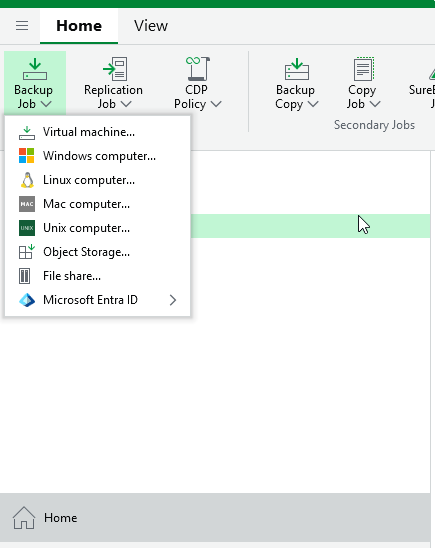    
After clicking on Virtual Machine:  
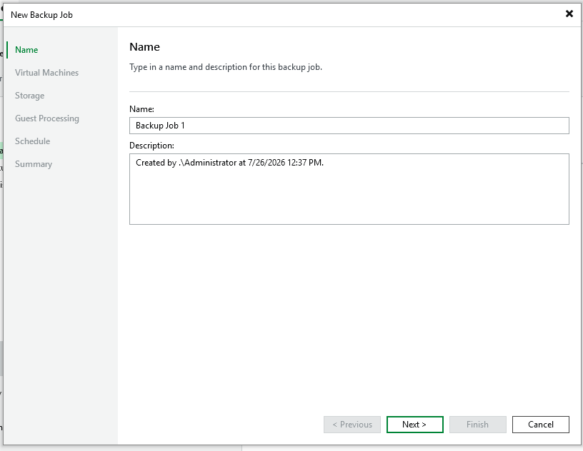    
Rename it to Proxmox-TestVM-HypervisorBackup then click next to the virtual machine option and click add and add 10.0.0.22 and confirm it before hitting next.  
For the credentials make sure to have it as root from the pve console in Proxmox and make sure to remove the 10.0.0.22 and add it again to get rid of stale UUID and create a new Veeam-Worker. 
Then on the Proxmox pve command line, install apt-get install -y inotify-tools which will fire on a instant then run this:  
pkill -f kvm-watcher    
nohup bash -c ' 
inotifywait -m /etc/pve/qemu-server/ -e create -e modify |  
while read dir event file; do   
    conf="/etc/pve/qemu-server/$file"   
    sleep 0.1   
    grep -q "^kvm:" "$conf" 2>/dev/null || sed -i "1s/^/kvm: 0\n/" "$conf"  
    echo "Patched $conf at $(date)" 
done    
' > /tmp/kvm-watcher.log 2>&1 & 
Then type sleep 2   
cat /tmp/kvm-watcher.log    
ps aux | grep inotify and tail -f /tmp/kvm-watcher.log  
This however will cause the script to write temp files and rename it to 101.conf to edit it like this:  
nohup bash -c ' 
inotifywait -m /etc/pve/qemu-server/ -e create -e modify -e moved_to |  
while read dir event file; do   
    conf="/etc/pve/qemu-server/$file"   
    [ -f "$conf" ] || continue  
    grep -q "^kvm:" "$conf" 2>/dev/null || sed -i "1s/^/kvm: 0\n/" "$conf"  
    echo "Patched $conf ($event) at $(date)"    
done    
' > /tmp/kvm-watcher.log 2>&1 & 
Then sleep 2 and cat /tmp/kvm-watcher.log.  
Then run pkill -f inotifywait   
nohup bash -c 'inotifywait -m /etc/pve/qemu-server/ -e create -e modify -e moved_to | while read dir event file; do conf="/etc/pve/qemu-server/$file"; [ -f "$conf" ] || continue; grep -q "^kvm:" "$conf" 2>/dev/null || sed -i "1s/^/kvm: 0\n/" "$conf"; echo "Patched $conf ($event) at $(date)"; done' > /tmp/kvm-watcher.log 2>&1 &    
sleep 2 
cat /tmp/kvm-watcher.log    
Then run the Veeam worker and likely run into only tmp files once again
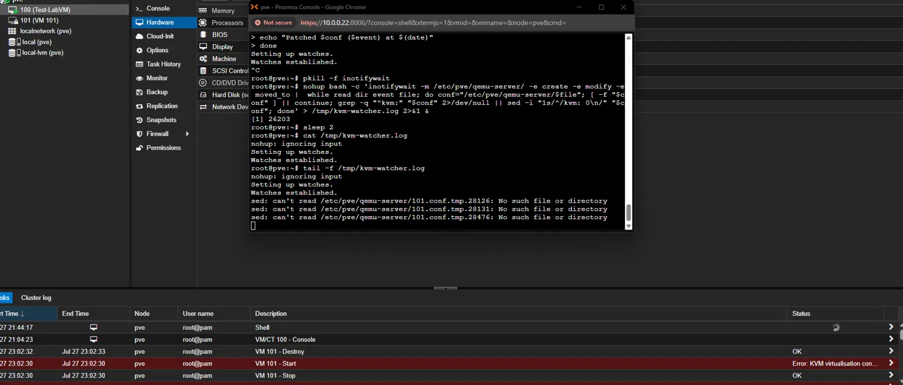   
Then try the Proxmox hookscript approach which will help intercept these events with this script:   
cat > /var/lib/vz/snippets/disable-kvm.sh << 'EOF'  
#!/bin/bash 
VMID=$1 
PHASE=$2    
if [ "$PHASE" = "pre-start" ]; then 
    qm set $VMID --kvm 0    
    echo "KVM disabled for VM $VMID" >> /tmp/hookscript.log 
fi  
EOF 
Then chmod +x /var/lib/vz/snippets/disable-kvm.sh.  
Based on this:  
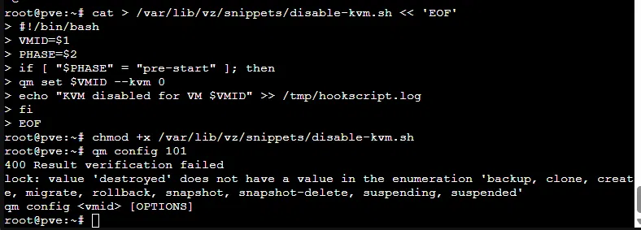 
The error says the VM was destroyed so run this script so that inotify catches and runs:    
pkill -f inotifywait
nohup bash -c 'inotifywait -m /etc/pve/qemu-server/ -e moved_to --format "%f" | while read file; do 
    VMID="${file%.conf}"    
    echo "Caught $file at $(date)" >> /tmp/kvm-watcher.log  
    qm set $VMID --kvm 0 >> /tmp/kvm-watcher.log 2>&    
    echo "Set kvm=0 on VM $VMID" >> /tmp/kvm-watcher.log    
done' > /tmp/kvm-watcher-err.log 2>&1 & 
Then sleep 2 and cat /tmp/kvm-watcher.log and see this: 
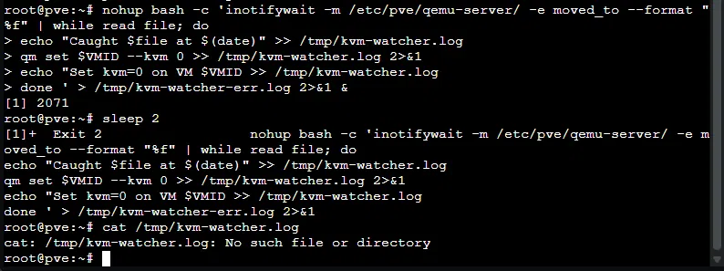 
Which shows that inotifywait is failing immediately so this script: 
cat > /tmp/kvm-fix.sh << 'EOF'  
#!/bin/bash 
inotifywait -m /etc/pve/qemu-server/ -e moved_to --format "%f" | while read file; do    
    VMID="${file%.conf}"    
    echo "Caught $file at $(date)" >> /tmp/kvm-watcher.log  
    qm set $VMID --kvm 0 >> /tmp/kvm-watcher.log 2>&1   
    echo "Set kvm=0 on VM $VMID" >> /tmp/kvm-watcher.log    
done    
EOF 
Then chmod +x /tmp/kvm-fix.sh, nohup bash /tmp/kvm-fix.sh > /tmp/kvm-watcher-err.log 2>&1 & then sleep 2 cat /tmp/kvm-watcher-err.log and cat /tmp/kvm-watcher.log. 
However this might say: 
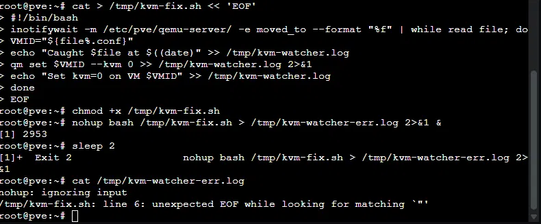 
So write with tee instead:  
tee /tmp/kvm-fix.sh << 'SCRIPT' 
#!/bin/bash 
inotifywait -m /etc/pve/qemu-server/ -e moved_to --format "%f" | while read file; do    
    VMID="${file%.conf}"    
    echo "Caught $file" >> /tmp/kvm-watcher.log 
    qm set $VMID --kvm 0 >> /tmp/kvm-watcher.log 2>&1   
    echo "Set kvm=0 on VM $VMID" >> /tmp/kvm-watcher.log    
done    
SCRIPT  
chmod +x /tmp/kvm-fix.sh and cat /tmp/kvm-fix.sh.   
Then run nohup bash /tmp/kvm-fix.sh > /tmp/kvm-watcher-err.log 2>&1 &, sleep 2, then cat /tmp/kvm-watcher-err.log which should show watches established. Then run the worker once again and see this:   
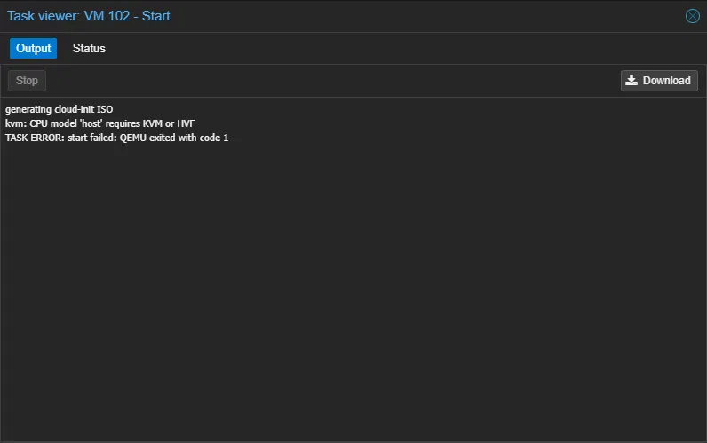 
This means kvm: 0 is now working but the script is configuring with host instead and update the script to be:   
tee /tmp/kvm-fix.sh << 'SCRIPT' 
#!/bin/bash 
inotifywait -m /etc/pve/qemu-server/ -e moved_to --format "%f" | while read file; do    
    VMID="${file%.conf}"    
    echo "Caught $file" >> /tmp/kvm-watcher.log 
    qm set $VMID --kvm 0 --cpu x86-64-v2-AES >> /tmp/kvm-watcher.log 2>&1   
    echo "Set kvm=0 and cpu on VM $VMID" >> /tmp/kvm-watcher.log    
done    
SCRIPT  
pkill -f kvm-fix.sh and nohup bash /tmp/kvm-fix.sh > /tmp/kvm-watcher-err.log 2>&1 &    
Then run the Worker again and see this: 
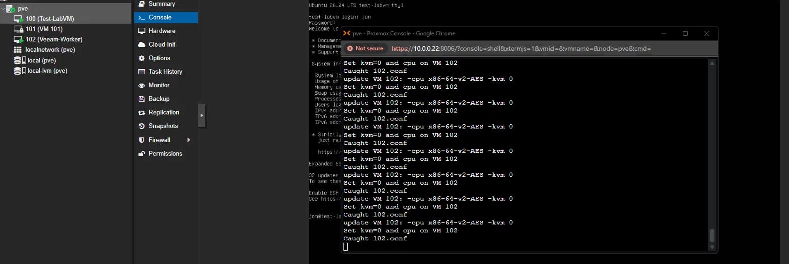 
Which shows it is running. However when it gets done it will destroy 102 and make the Veeam Worker disappear.   
To get it to come back type Win+R and type appwiz.cpl and look for Veeam Plug-In for Proxmox Virtual Environment and uninstall it   
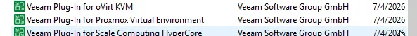   
Then go and restart Veeam Backup Services in services.msc and after that go find the iso for Veeam and mount it in the VM   
    
Right click on it and mount it and when done click on Plugins to see this:  
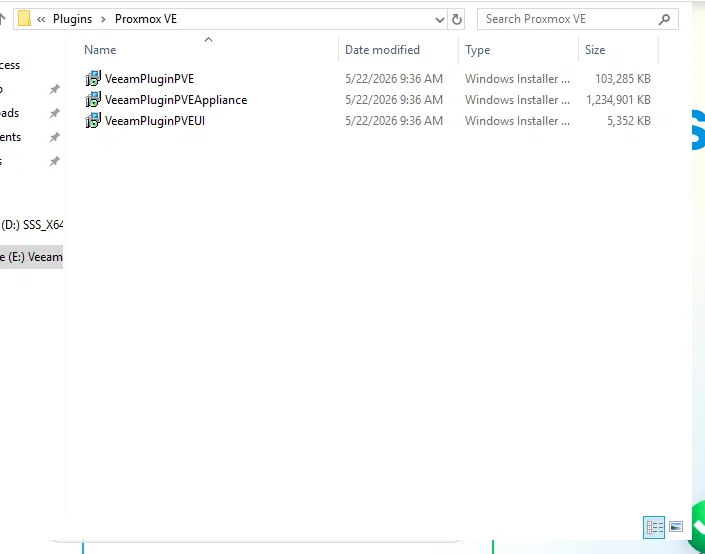 
Then install them in this order: VeeamPluginPVE, VeeamPluginPVEUI, and then VeeamPluginPVEAppliance. When done restart Veeam Backup Service and or restart the VM and it should be back up after getting things back up again.  
Then go and set up a new Backup Job since the prior was deleted named Proxmox-HypervisorBackup and then click next and expand 10.0.0.22 to see this:    
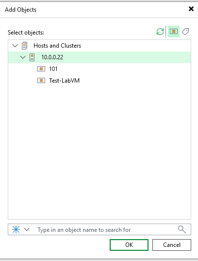    
Click on TestLab option and click add and hit next to get to storage.   
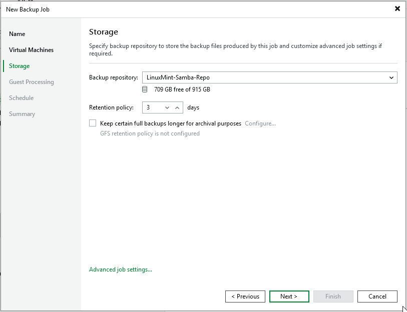  
Have the LinuxMint repo selected and hit next till apply and finish. There is the option to do automatic but not right now. 
Then after apply and finish should see it here: 
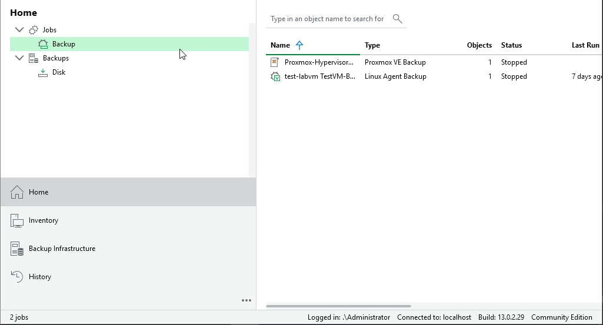  
Then right click it and hit start and then see the running status and watch the Proxmox console 
After a few minutes this will pop up:   
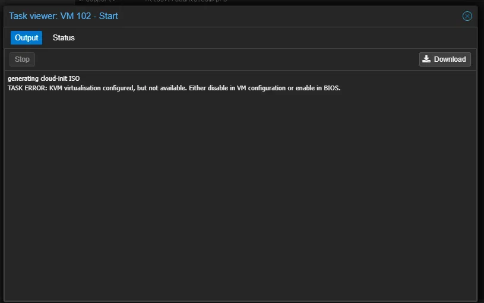 
Meaning the KVM error is occuring so run this script so it can catch better:    
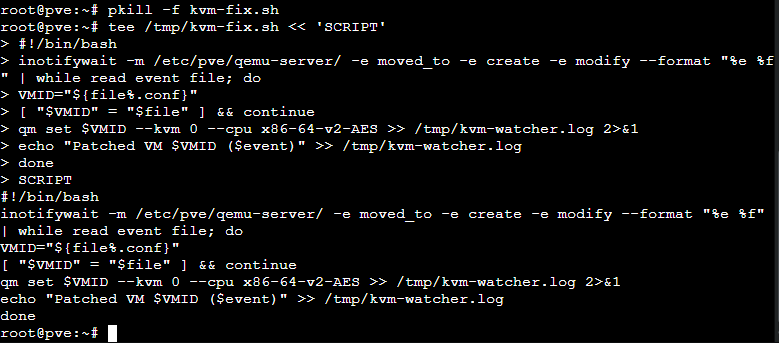  
Then run nohup bash /tmp/kvm-fix.sh > /tmp/kvm-watcher-err.log 2>&1 &   
sleep 2 
cat /tmp/kvm-watcher-err.log and then go run the job again. 
However after doing testing and research it seems that in order for hypervisor to work that a bare metal host or a laptop to where certain settings such as Virtualization Based Security can be turned off. The veeam-issue.md file explains more. 

# Automatic Scheduling
Setting up automatic/automated scheduled backups help with automating certain repeat tasks  
Start by going to the Test VM and in the command line type sudo veeamconfig schedule set --jobName "TestVM-Backup" --daily --at "18:45"    
*This can be any time*  
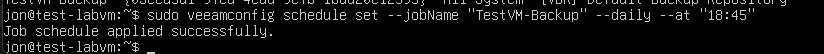    
Then verify by running sudo veeamconfig schedule show --jobName "TestVM-Backup" like so:    
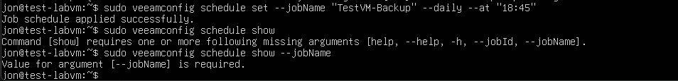    
For the purposes of this I set it at 7:10 PM CST or in the Linux VM to 00:10 PM based off UTC which should trigger in VM and in Veeam:  
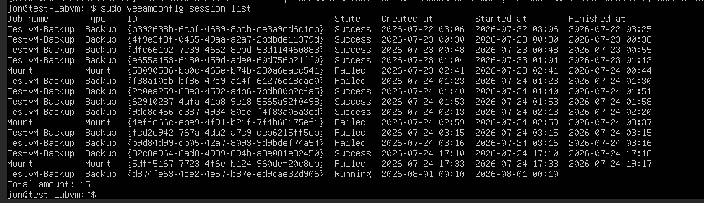  
Then after about 10 minutes it is done for the auto schedule:   
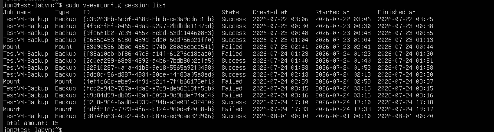    
And in the Windows Server VM:   
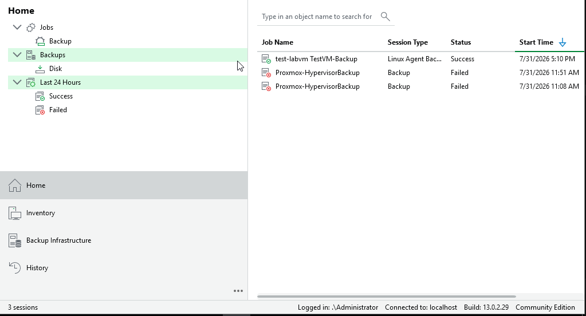    

# Monitoring & Alerting
Having a good monitor and alert system is key in knowing if something has occured   
On the host computer, go to myaccount.google.com/apppasswords and create a app password for Veeam called VeeamLab and then download the notify.sh script and replace SMTP_USER, MAIL_FROM, and MAIL_TO with your emails and SMTP_PASS with your Gmail app password. 
Then after editing it type sudo cp notify.sh /opt/veeam/notify.sh and then sudo chmod +x /opt/veeam/notify.sh to make it executable and run.    
Run it by typing sudo /opt/veeam/notify.sh and if any errors pop up just do the sudo tee method or this base63 method:   
Then sudo chmod +x /opt/veeam/notify.sh and bash -n /opt/veeam/notify.sh && echo "SYNTAX OK" to verify it says syntax OK.   
To verify correct output with base64 run cat -A /opt/veeam/notify.sh | sed -n '1,20p'   
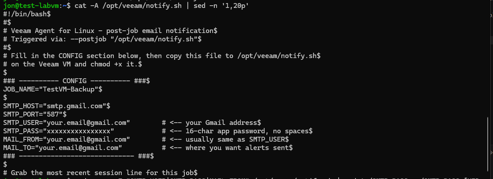  
Then run sudo /opt/veeam/notify.sh once again:  
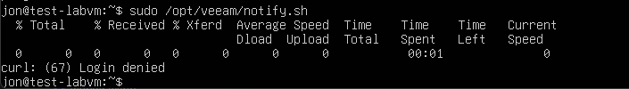    
The denied means that the SMTP_USER and FROM_FROM and other inputs need to be changed, so go and change it. Then verify with sudo grep -E "SMTP_USER|MAIL_FROM|MAIL_TO" /opt/veeam/notify.sh    
Then run sudo /opt/veeam/notify.sh to see this: 
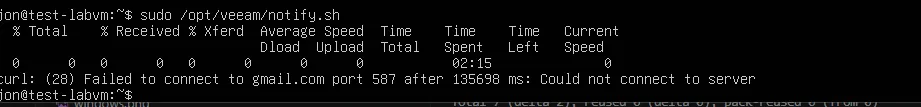   
This shows this might be a network connection issue run these commands: 
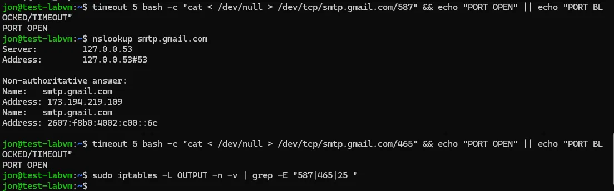   
Running these commands shows that PORT 587 is open along with 465 with success with DNS so this points to a IPv6 routing issue which would mean that IPv4 is broken but likely a false positive or a TLS handshake stalling with it accepting a connection but not completing so test by running:   
curl -4 --ssl-reqd --url "smtp://smtp.gmail.com:587" --user "jontaylor8104@gmail.com:REPLACE_WITH_APP_PASSWORD" --mail-from     "jontaylor8104@gmail.com" --mail-rcpt "jutaylor659@gmail.com" --upload-file - --max-time 15 <<EOF   
From: Test <jontaylor8104@gmail.com>    
To: jutaylor659@gmail.com   
Subject: IPv4 test  

Testing IPv4 forced connection. 
EOF 
And replace with the actual app password to see this:   
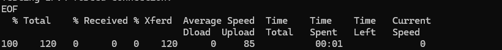    
Then run:   
curl -v -4 --ssl-reqd --url "smtp://smtp.gmail.com:587" --user "jontaylor8104@gmail.com:REPLACE_WITH_APP_PASSWORD" --mail-from "jontaylor8104@gmail.com" --mail-rcpt "jutaylor659@gmail.com" --upload-file - --max-time 15 <<EOF    
Subject: test   

test    
EOF 
And replace with the actual app password to see this:   
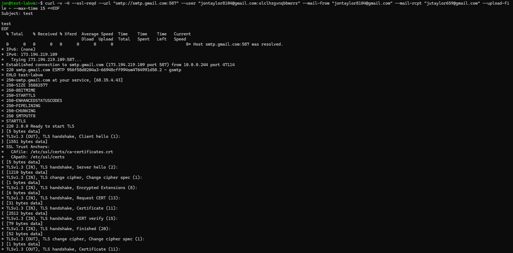    
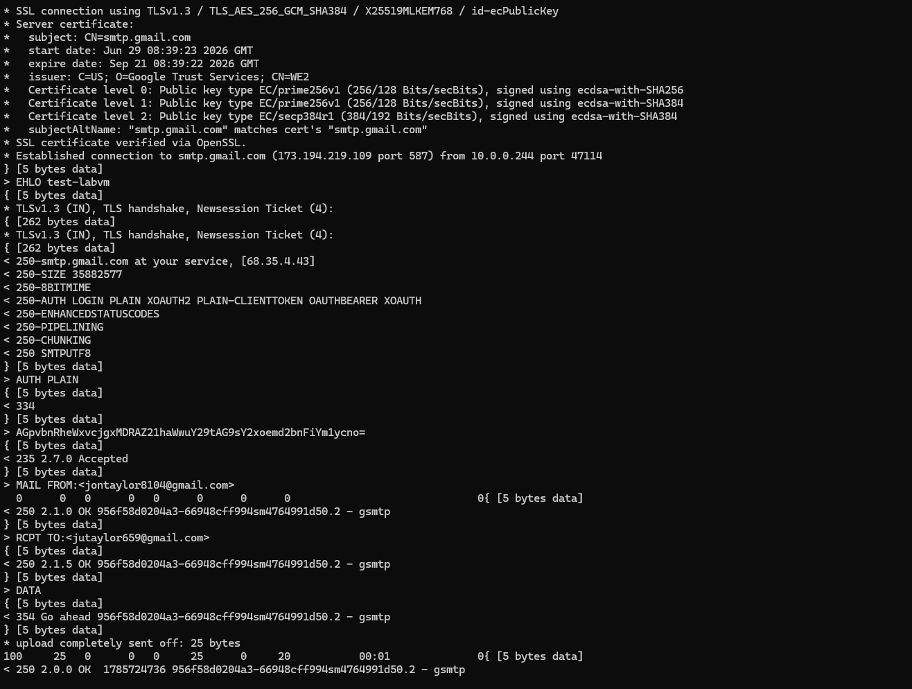    
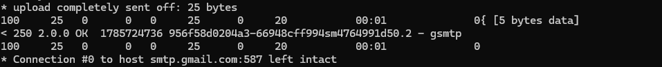    
From looking over this it appears the issue is with curl so edit the file where it says curl --ssl-reqd \ to curl -4 --sl-reqd \ and save it and run sudo /opt/veeam/notify.sh once again and should see this:  
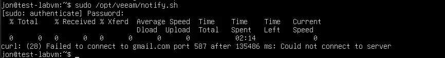   
It errored again so run bash -x /opt/veeam/notify.sh which will show where its erroring:    
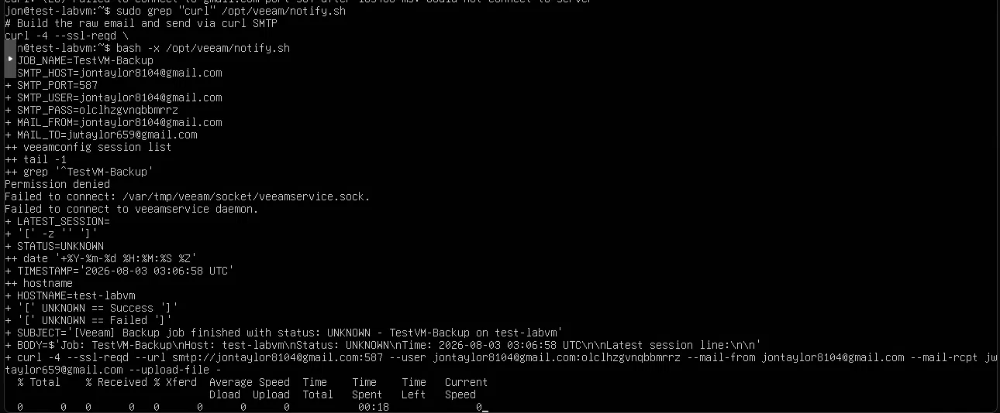   
Which shows that a line got overwritten for SMTP_HOST in which it should be smtp.gmail.com so fix it by running:    
sudo sed -i 's/SMTP_HOST=.*/SMTP_HOST="smtp.gmail.com"/' /opt/veeam/notify.sh   
And verify by running:  
sudo grep -E "^JOB_NAME=|^SMTP_HOST=|^SMTP_PORT=|^SMTP_USER=|^MAIL_FROM=|^MAIL_TO=" /opt/veeam/notify.sh to see this:   
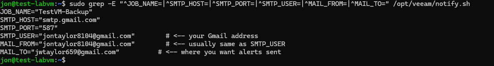  
Then run sudo /opt/veeam/notify.sh in which it should trigger like so:  
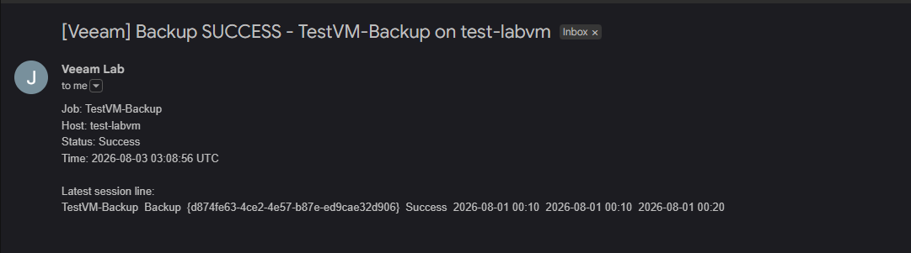    
Emails are working now so should be implemented into the workflow by running:   
sudo veeamconfig job edit volumeLevel --postjob "/opt/veeam/notify.sh" for --name "TestVM-Backup" which will add like so:   
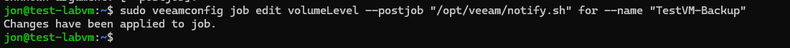  
Then confirm by running sudo veeamconfig job start --name "TestVM-Backup" to confirm:   
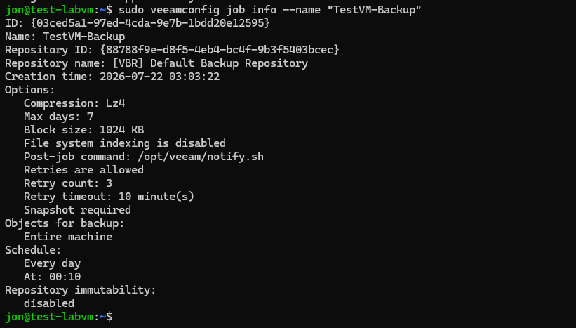    
Then run sudo veeamconfig job start --name "TestVM-Backup" and wait a few minutes:  
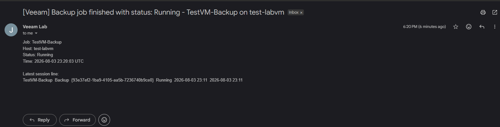    
  
This mismatch means that it didn't catch the finish state by adding a delay/retry loop so run this: 
echo "IyEvYmluL2Jhc2gKIwojIFZlZWFtIEFnZW50IGZvciBMaW51eCAtIHBvc3Qtam9iIGVtYWlsIG5vdGlmaWNhdGlvbgojIFRyaWdnZXJlZCB2aWE6IC0tcG9zdGpvYiAiL29wdC92ZWVhbS9ub3RpZnkuc2giCiMKIyBGaWxsIGluIHRoZSBDT05GSUcgc2VjdGlvbiBiZWxvdywgdGhlbiBjb3B5IHRoaXMgZmlsZSB0byAvb3B0L3ZlZWFtL25vdGlmeS5zaAojIG9uIHRoZSBWZWVhbSBWTSBhbmQgY2htb2QgK3ggaXQuCgojIyMgLS0tLS0tLS0tLSBDT05GSUcgLS0tLS0tLS0tLSAjIyMKSk9CX05BTUU9IlRlc3RWTS1CYWNrdXAiCgpTTVRQX0hPU1Q9InNtdHAuZ21haWwuY29tIgpTTVRQX1BPUlQ9IjU4NyIKU01UUF9VU0VSPSJ5b3VyLmVtYWlsQGdtYWlsLmNvbSIgICAgICAgICMgPC0tIHlvdXIgR21haWwgYWRkcmVzcwpTTVRQX1BBU1M9Inh4eHh4eHh4eHh4eHh4eHgiICAgICAgICAgICAgIyA8LS0gMTYtY2hhciBhcHAgcGFzc3dvcmQsIG5vIHNwYWNlcwpNQUlMX0ZST009InlvdXIuZW1haWxAZ21haWwuY29tIiAgICAgICAgIyA8LS0gdXN1YWxseSBzYW1lIGFzIFNNVFBfVVNFUgpNQUlMX1RPPSJ5b3VyLmVtYWlsQGdtYWlsLmNvbSIgICAgICAgICAgIyA8LS0gd2hlcmUgeW91IHdhbnQgYWxlcnRzIHNlbnQKIyMjIC0tLS0tLS0tLS0tLS0tLS0tLS0tLS0tLS0tLS0tICMjIwoKIyBHcmFiIHRoZSBtb3N0IHJlY2VudCBzZXNzaW9uIGxpbmUgZm9yIHRoaXMgam9iLgojIFRoZSBwb3N0LWpvYiBob29rIGNhbiBmaXJlIGEgYmVhdCBiZWZvcmUgdGhlIHNlc3Npb24gdGFibGUncyBmaW5hbAojIHN0YXR1cyB3cml0ZSBsYW5kcywgc28gcG9sbCBicmllZmx5IHVudGlsIGl0IHNldHRsZXMgb3V0IG9mICJSdW5uaW5nIi4KTUFYX1dBSVRfU0VDT05EUz0zMApQT0xMX0lOVEVSVkFMPTIKRUxBUFNFRD0wCgp3aGlsZSB0cnVlOyBkbwogICAgTEFURVNUX1NFU1NJT049JCh2ZWVhbWNvbmZpZyBzZXNzaW9uIGxpc3QgfCBncmVwICJeJHtKT0JfTkFNRX0iIHwgdGFpbCAtMSkKCiAgICBpZiBbIC16ICIkTEFURVNUX1NFU1NJT04iIF07IHRoZW4KICAgICAgICBTVEFUVVM9IlVOS05PV04iCiAgICAgICAgYnJlYWsKICAgIGZpCgogICAgU1RBVFVTPSQoZWNobyAiJExBVEVTVF9TRVNTSU9OIiB8IGF3ayAne2ZvcihpPTE7aTw9TkY7aSsrKXtpZigkaT09IlN1Y2Nlc3MifHwkaT09IkZhaWxlZCJ8fCRpPT0iUnVubmluZyJ8fCRpPT0iV2FybmluZyIpe3ByaW50ICRpOyBleGl0fX19JykKCiAgICBpZiBbICIkU1RBVFVTIiAhPSAiUnVubmluZyIgXTsgdGhlbgogICAgICAgIGJyZWFrCiAgICBmaQoKICAgIGlmIFsgIiRFTEFQU0VEIiAtZ2UgIiRNQVhfV0FJVF9TRUNPTkRTIiBdOyB0aGVuCiAgICAgICAgIyBHYXZlIGl0IGEgZmFpciBjaGFuY2U7IHJlcG9ydCB3aGF0ZXZlciB3ZSBsYXN0IHNhdyByYXRoZXIgdGhhbiBoYW5nIGZvcmV2ZXIuCiAgICAgICAgYnJlYWsKICAgIGZpCgogICAgc2xlZXAgIiRQT0xMX0lOVEVSVkFMIgogICAgRUxBUFNFRD0kKChFTEFQU0VEICsgUE9MTF9JTlRFUlZBTCkpCmRvbmUKClRJTUVTVEFNUD0kKGRhdGUgIislWS0lbS0lZCAlSDolTTolUyAlWiIpCkhPU1ROQU1FPSQoaG9zdG5hbWUpCgppZiBbICIkU1RBVFVTIiA9PSAiU3VjY2VzcyIgXTsgdGhlbgogICAgU1VCSkVDVD0iW1ZlZWFtXSBCYWNrdXAgU1VDQ0VTUyAtICR7Sk9CX05BTUV9IG9uICR7SE9TVE5BTUV9IgplbGlmIFsgIiRTVEFUVVMiID09ICJGYWlsZWQiIF07IHRoZW4KICAgIFNVQkpFQ1Q9IltWZWVhbV0gQmFja3VwIEZBSUxFRCAtICR7Sk9CX05BTUV9IG9uICR7SE9TVE5BTUV9IgplbHNlCiAgICBTVUJKRUNUPSJbVmVlYW1dIEJhY2t1cCBqb2IgZmluaXNoZWQgd2l0aCBzdGF0dXM6ICR7U1RBVFVTfSAtICR7Sk9CX05BTUV9IG9uICR7SE9TVE5BTUV9IgpmaQoKQk9EWT0iSm9iOiAke0pPQl9OQU1FfQpIb3N0OiAke0hPU1ROQU1FfQpTdGF0dXM6ICR7U1RBVFVTfQpUaW1lOiAke1RJTUVTVEFNUH0KCkxhdGVzdCBzZXNzaW9uIGxpbmU6CiR7TEFURVNUX1NFU1NJT059CiIKCiMgQnVpbGQgdGhlIHJhdyBlbWFpbCBhbmQgc2VuZCB2aWEgY3VybCBTTVRQCiMgLTQgZm9yY2VzIElQdjQ7IHRoaXMgVk0ncyBJUHY2IHBhdGggdG8gR21haWwgd2FzIHVucmVhY2hhYmxlIGFuZCBjYXVzZWQKIyBjdXJsIHRvIHNpbGVudGx5IHN0YWxsIGZvciAxMDArIHNlY29uZHMgYmVmb3JlIGdpdmluZyB1cC4KY3VybCAtNCAtLXNzbC1yZXFkIFwKICAtLXVybCAic210cDovLyR7U01UUF9IT1NUfToke1NNVFBfUE9SVH0iIFwKICAtLXVzZXIgIiR7U01UUF9VU0VSfToke1NNVFBfUEFTU30iIFwKICAtLW1haWwtZnJvbSAiJHtNQUlMX0ZST019IiBcCiAgLS1tYWlsLXJjcHQgIiR7TUFJTF9UT30iIFwKICAtLXVwbG9hZC1maWxlIC0gPDxFT0YKRnJvbTogVmVlYW0gTGFiIDwke01BSUxfRlJPTX0+ClRvOiAke01BSUxfVE99ClN1YmplY3Q6ICR7U1VCSkVDVH0KCiR7Qk9EWX0KRU9GCgpleGl0IDAK" | base64 -d | sudo tee /opt/veeam/notify.sh > /dev/null 
When using a base64 calculator changing to a default state, so then type sudo chmod +x /opt/veeam/notify.sh then bash -n /opt/veeam/notify.sh && echo "SYNTAX OK"   
Then type sudo sed -i /
             -e 's/SMTP_USER=*/SMTP_USER="youremail@email.com'
             -e 's/SMTP_PASS=*/SMTP_PASS="apppassword'
             -e 's/SMTP_FROM=*/MAIL_FROM="youremail@email.com'
             -e 's/MAIL_TO=*/MAIL_TO="youremail@email.com'
             /opt/veeam/notify.sh
Then type bash -n /opt/veeam/notify.sh && echo "SYNTAX OK"  
Then run again with sudo veeamconfig job start --name "TestVM-Backup" and watch with sudo veeamconfig session list. When done run sudo tail -40 /var/log/veeam-notify.log like so:  
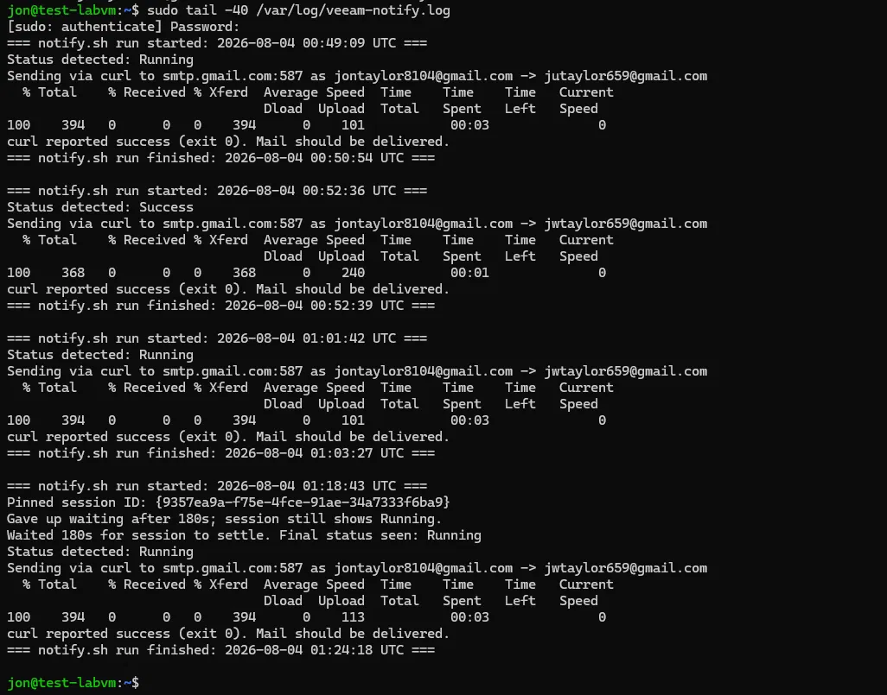   
The error is that Veeam doesn't finalize till after the script ends at around 1:24 mark which means its waiting for manual input.   
Run this fir notify.sh:   
echo "IyEvYmluL2Jhc2gKIwojIFZlZWFtIEFnZW50IGZvciBMaW51eCAtIHBvc3Qtam9iIGVtYWlsIG5vdGlmaWNhdGlvbiBsYXVuY2hlci4KIyBUcmlnZ2VyZWQgdmlhOiAtLXBvc3Rqb2IgIi9vcHQvdmVlYW0vbm90aWZ5LnNoIgojCiMgVGhpcyBzY3JpcHQgZG9lcyBhbG1vc3Qgbm90aGluZyBpdHNlbGY6IGl0IGdyYWJzIHRoZSBjdXJyZW50IHNlc3Npb24gSUQKIyBmb3IgdGhpcyBqb2IgYW5kIGhhbmRzIG9mZiB0byBub3RpZnktd29ya2VyLnNoIGFzIGEgZnVsbHkgZGV0YWNoZWQKIyBiYWNrZ3JvdW5kIHByb2Nlc3MsIHRoZW4gcmV0dXJucyBpbW1lZGlhdGVseS4KIwojIFdIWTogVmVlYW0gZG9lcyBub3Qgd3JpdGUgYSBzZXNzaW9uJ3MgZmluYWwgU3VjY2Vzcy9GYWlsZWQgc3RhdHVzIHVudGlsCiMgQUZURVIgdGhpcyBwb3N0am9iIHNjcmlwdCByZXR1cm5zLiBJZiB3ZSB3YWl0IGluIGhlcmUgZm9yIHRoYXQgc3RhdHVzLAojIHdlIGRlYWRsb2NrIGFnYWluc3QgVmVlYW0uIFNvIHdlIHJldHVybiByaWdodCBhd2F5IGFuZCBsZXQgdGhlIHdvcmtlcgojICh3aGljaCBpcyBubyBsb25nZXIgYmxvY2tpbmcgVmVlYW0pIGRvIHRoZSBhY3R1YWwgd2FpdGluZyArIGVtYWlsaW5nLgoKSk9CX05BTUU9IlRlc3RWTS1CYWNrdXAiCkxPR0ZJTEU9Ii92YXIvbG9nL3ZlZWFtLW5vdGlmeS5sb2ciCldPUktFUj0iL29wdC92ZWVhbS9ub3RpZnktd29ya2VyLnNoIgoKewogICAgZWNobyAiPT09IG5vdGlmeS5zaCBsYXVuY2hlciBmaXJlZDogJChkYXRlICcrJVktJW0tJWQgJUg6JU06JVMgJVonKSA9PT0iCiAgICBQSU5ORURfU0VTU0lPTl9JRD0kKHZlZWFtY29uZmlnIHNlc3Npb24gbGlzdCB8IGdyZXAgIl4ke0pPQl9OQU1FfSIgfCB0YWlsIC0xIHwgZ3JlcCAtb1AgJ1x7W2EtZjAtOS1dK1x9JykKICAgIGVjaG8gIkhhbmRpbmcgb2ZmIHNlc3Npb24gSUQgJHtQSU5ORURfU0VTU0lPTl9JRDotPG5vbmUgZm91bmQ+fSB0byB3b3JrZXIgKGRldGFjaGVkKS4iCn0gPj4gIiRMT0dGSUxFIiAyPiYxCgpub2h1cCAiJFdPUktFUiIgIiRQSU5ORURfU0VTU0lPTl9JRCIgPj4gIiRMT0dGSUxFIiAyPiYxIDwgL2Rldi9udWxsICYKZGlzb3duCgpleGl0IDAK" | base64 -d | sudo tee /opt/veeam/notify.sh > /dev/null.    
Then this for notify-worker.sh:  
echo "IyEvYmluL2Jhc2gKIwojIFdvcmtlciBmb3IgVmVlYW0gcG9zdC1qb2IgZW1haWwgbm90aWZpY2F0aW9uLiBOb3QgY2FsbGVkIGRpcmVjdGx5IGJ5CiMgVmVlYW0gLSBsYXVuY2hlZCBkZXRhY2hlZCBieSBub3RpZnkuc2gsIHdoaWNoIHJldHVybnMgdG8gVmVlYW0gaW1tZWRpYXRlbHkuCiMKIyBXSFkgVEhJUyBFWElTVFM6IFZlZWFtIGRvZXMgbm90IGZpbmFsaXplIGEgc2Vzc2lvbidzIFN1Y2Nlc3MvRmFpbGVkIHN0YXR1cwojIGluIGB2ZWVhbWNvbmZpZyBzZXNzaW9uIGxpc3RgIHVudGlsIEFGVEVSIHRoZSAtLXBvc3Rqb2Igc2NyaXB0IHJldHVybnMuCiMgSWYgdGhlIHBvc3Rqb2Igc2NyaXB0IGl0c2VsZiB3YWl0cyBmb3IgdGhhdCBmaW5hbCBzdGF0dXMsIGl0IGRlYWRsb2NrcwojIGFnYWluc3QgVmVlYW0gLSBWZWVhbSBpcyB3YWl0aW5nIG9uIHRoZSBzY3JpcHQsIHRoZSBzY3JpcHQgaXMgd2FpdGluZyBvbgojIFZlZWFtLiBUaGlzIHdvcmtlciBydW5zIGluZGVwZW5kZW50bHkgYWZ0ZXIgbm90aWZ5LnNoIGhhcyBhbHJlYWR5IGhhbmRlZAojIGNvbnRyb2wgYmFjaywgc28gaXQgY2FuIHNhZmVseSB3YWl0IGZvciB0aGUgcmVhbCBmaW5hbCBzdGF0dXMuCgojIyMgLS0tLS0tLS0tLSBDT05GSUcgLS0tLS0tLS0tLSAjIyMKSk9CX05BTUU9IlRlc3RWTS1CYWNrdXAiCgpTTVRQX0hPU1Q9InNtdHAuZ21haWwuY29tIgpTTVRQX1BPUlQ9IjU4NyIKU01UUF9VU0VSPSJ5b3VyLmVtYWlsQGdtYWlsLmNvbSIgICAgICAgICMgPC0tIHlvdXIgR21haWwgYWRkcmVzcwpTTVRQX1BBU1M9Inh4eHh4eHh4eHh4eHh4eHgiICAgICAgICAgICAgIyA8LS0gMTYtY2hhciBhcHAgcGFzc3dvcmQsIG5vIHNwYWNlcwpNQUlMX0ZST009InlvdXIuZW1haWxAZ21haWwuY29tIiAgICAgICAgIyA8LS0gdXN1YWxseSBzYW1lIGFzIFNNVFBfVVNFUgpNQUlMX1RPPSJ5b3VyLmVtYWlsQGdtYWlsLmNvbSIgICAgICAgICAgIyA8LS0gd2hlcmUgeW91IHdhbnQgYWxlcnRzIHNlbnQKIyMjIC0tLS0tLS0tLS0tLS0tLS0tLS0tLS0tLS0tLS0tICMjIwoKTE9HRklMRT0iL3Zhci9sb2cvdmVlYW0tbm90aWZ5LmxvZyIKZXhlYyA+PiAiJExPR0ZJTEUiIDI+JjEKZWNobyAiLS0tIG5vdGlmeS13b3JrZXIuc2ggc3RhcnRlZDogJChkYXRlICcrJVktJW0tJWQgJUg6JU06JVMgJVonKSAtLS0iCgpQSU5ORURfU0VTU0lPTl9JRD0iJDEiCmVjaG8gIlBpbm5lZCBzZXNzaW9uIElEIChmcm9tIGxhdW5jaGVyKTogJHtQSU5ORURfU0VTU0lPTl9JRDotPG5vbmUgcGFzc2VkPn0iCgppZiBbIC16ICIkUElOTkVEX1NFU1NJT05fSUQiIF07IHRoZW4KICAgIGVjaG8gIk5vIHNlc3Npb24gSUQgd2FzIHBhc3NlZCBpbiAtIGZhbGxpbmcgYmFjayB0byAnbGF0ZXN0IGxpbmUnIGxvb2t1cC4iCmZpCgpNQVhfV0FJVF9TRUNPTkRTPTE4MApQT0xMX0lOVEVSVkFMPTUKRUxBUFNFRD0wClNUQVRVUz0iVU5LTk9XTiIKTEFURVNUX1NFU1NJT049IiIKCndoaWxlIHRydWU7IGRvCiAgICBpZiBbIC1uICIkUElOTkVEX1NFU1NJT05fSUQiIF07IHRoZW4KICAgICAgICBMQVRFU1RfU0VTU0lPTj0kKHZlZWFtY29uZmlnIHNlc3Npb24gbGlzdCB8IGdyZXAgIl4ke0pPQl9OQU1FfSIgfCBncmVwIC1GICIkUElOTkVEX1NFU1NJT05fSUQiKQogICAgZWxzZQogICAgICAgIExBVEVTVF9TRVNTSU9OPSQodmVlYW1jb25maWcgc2Vzc2lvbiBsaXN0IHwgZ3JlcCAiXiR7Sk9CX05BTUV9IiB8IHRhaWwgLTEpCiAgICBmaQoKICAgIGlmIFsgLXogIiRMQVRFU1RfU0VTU0lPTiIgXTsgdGhlbgogICAgICAgIFNUQVRVUz0iVU5LTk9XTiIKICAgICAgICBicmVhawogICAgZmkKCiAgICBTVEFUVVM9JChlY2hvICIkTEFURVNUX1NFU1NJT04iIHwgYXdrICd7Zm9yKGk9MTtpPD1ORjtpKyspe2lmKCRpPT0iU3VjY2VzcyJ8fCRpPT0iRmFpbGVkInx8JGk9PSJSdW5uaW5nInx8JGk9PSJXYXJuaW5nIil7cHJpbnQgJGk7IGV4aXR9fX0nKQoKICAgIGlmIFsgIiRTVEFUVVMiICE9ICJSdW5uaW5nIiBdOyB0aGVuCiAgICAgICAgYnJlYWsKICAgIGZpCgogICAgaWYgWyAiJEVMQVBTRUQiIC1nZSAiJE1BWF9XQUlUX1NFQ09ORFMiIF07IHRoZW4KICAgICAgICBlY2hvICJHYXZlIHVwIHdhaXRpbmcgYWZ0ZXIgJHtNQVhfV0FJVF9TRUNPTkRTfXM7IHNlc3Npb24gc3RpbGwgc2hvd3MgUnVubmluZy4iCiAgICAgICAgYnJlYWsKICAgIGZpCgogICAgc2xlZXAgIiRQT0xMX0lOVEVSVkFMIgogICAgRUxBUFNFRD0kKChFTEFQU0VEICsgUE9MTF9JTlRFUlZBTCkpCmRvbmUKCmVjaG8gIldhaXRlZCAke0VMQVBTRUR9cy4gRmluYWwgc3RhdHVzIHNlZW46ICR7U1RBVFVTfSIKClRJTUVTVEFNUD0kKGRhdGUgIislWS0lbS0lZCAlSDolTTolUyAlWiIpCkhPU1ROQU1FPSQoaG9zdG5hbWUpCgppZiBbICIkU1RBVFVTIiA9PSAiU3VjY2VzcyIgXTsgdGhlbgogICAgU1VCSkVDVD0iW1ZlZWFtXSBCYWNrdXAgU1VDQ0VTUyAtICR7Sk9CX05BTUV9IG9uICR7SE9TVE5BTUV9IgplbGlmIFsgIiRTVEFUVVMiID09ICJGYWlsZWQiIF07IHRoZW4KICAgIFNVQkpFQ1Q9IltWZWVhbV0gQmFja3VwIEZBSUxFRCAtICR7Sk9CX05BTUV9IG9uICR7SE9TVE5BTUV9IgplbHNlCiAgICBTVUJKRUNUPSJbVmVlYW1dIEJhY2t1cCBqb2IgZmluaXNoZWQgd2l0aCBzdGF0dXM6ICR7U1RBVFVTfSAtICR7Sk9CX05BTUV9IG9uICR7SE9TVE5BTUV9IgpmaQoKQk9EWT0iSm9iOiAke0pPQl9OQU1FfQpIb3N0OiAke0hPU1ROQU1FfQpTdGF0dXM6ICR7U1RBVFVTfQpUaW1lOiAke1RJTUVTVEFNUH0KCkxhdGVzdCBzZXNzaW9uIGxpbmU6CiR7TEFURVNUX1NFU1NJT059CiIKCmVjaG8gIlNlbmRpbmcgdmlhIGN1cmwgdG8gJHtTTVRQX0hPU1R9OiR7U01UUF9QT1JUfSBhcyAke1NNVFBfVVNFUn0gLT4gJHtNQUlMX1RPfSIKCmN1cmwgLTQgLS1zc2wtcmVxZCAtLW1heC10aW1lIDMwIFwKICAtLXVybCAic210cDovLyR7U01UUF9IT1NUfToke1NNVFBfUE9SVH0iIFwKICAtLXVzZXIgIiR7U01UUF9VU0VSfToke1NNVFBfUEFTU30iIFwKICAtLW1haWwtZnJvbSAiJHtNQUlMX0ZST019IiBcCiAgLS1tYWlsLXJjcHQgIiR7TUFJTF9UT30iIFwKICAtLXVwbG9hZC1maWxlIC0gPDxFT0YKRnJvbTogVmVlYW0gTGFiIDwke01BSUxfRlJPTX0+ClRvOiAke01BSUxfVE99ClN1YmplY3Q6ICR7U1VCSkVDVH0KCiR7Qk9EWX0KRU9GCgpDVVJMX0VYSVQ9JD8KCmlmIFsgIiRDVVJMX0VYSVQiIC1lcSAwIF07IHRoZW4KICAgIGVjaG8gImN1cmwgcmVwb3J0ZWQgc3VjY2VzcyAoZXhpdCAwKS4gTWFpbCBzaG91bGQgYmUgZGVsaXZlcmVkLiIKZWxzZQogICAgZWNobyAiY3VybCBGQUlMRUQgd2l0aCBleGl0IGNvZGUgJHtDVVJMX0VYSVR9LiBNYWlsIHdhcyBOT1Qgc2VudC4iCmZpCgplY2hvICItLS0gbm90aWZ5LXdvcmtlci5zaCBmaW5pc2hlZDogJChkYXRlICcrJVktJW0tJWQgJUg6JU06JVMgJVonKSAtLS0iCmVjaG8gIiIKCmV4aXQgIiRDVVJMX0VYSVQiCg==" | base64 -d | sudo tee /opt/veeam/notify-worker.sh > /dev/null
Then:
sudo chmod +x /opt/veeam/notify.sh /opt/veeam/notify-worker.sh  
bash -n /opt/veeam/notify.sh && echo "LAUNCHER SYNTAX OK"   
bash -n /opt/veeam/notify-worker.sh && echo "WORKER SYNTAX OK"  
Then run the sudo sed once again and then bash -n /opt/veeam/notify-worker.sh && echo "SYNTAX OK". Then run the job start once again and wait a few minutes and after about 9 minutes:  
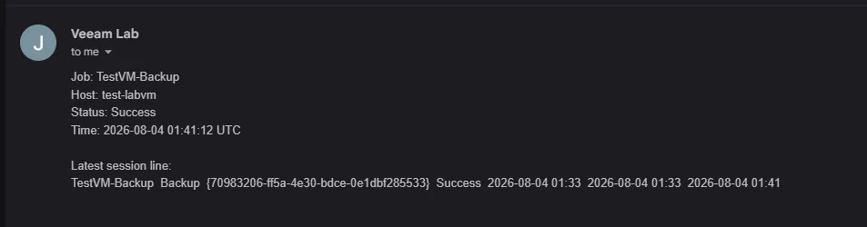   

# Security
When it comes to securing backups its important that users have the correct permissions in place so that important backups aren't destroyed which is where immutability comes in. It means that once a backup file is written, the repo refuses to modify/delete it until the period expires.   
Start by running sudo veeamconfig repository list and then sudo veeamconfig repository info --name "Default Backup Repository": 
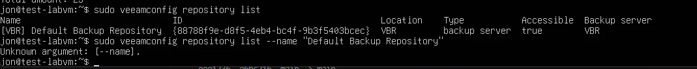 
This shows that the connectivity of where the storage is on the VBR server. Since the Windows Server VM is 10.0.0.116 run the command sudo veeamconfig vbrServer --help along with sudo veeamconfig vbrServer list  
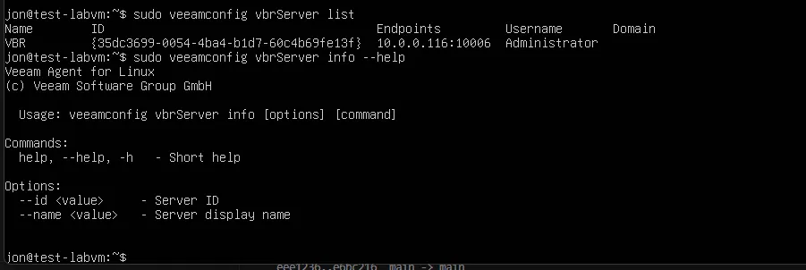   
vbrServer list shows where the port is and where its authenticating as with the port as 100006. Then on the Linux computer enable RDP in the Windows Server or just get into the Windows Server VM and view the Default Repository to see if there are some options available or run this powershell command with output:   
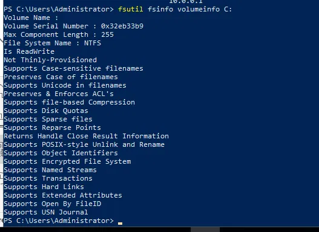   
Which shows that the C drive doesn't support immutability, so close out of the VM and add another hard disk of around 20-50 GB and start it back up again, then open disk management or diskmgmt.msc    
A pop up will appear and select GPT which will initialize, then right click in the Unallocated space and click on New Simple Volume:    
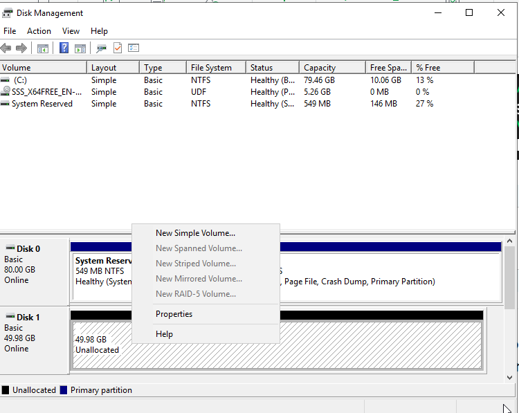  
Then click through till getting to the drive letter like E then click next and get here:    
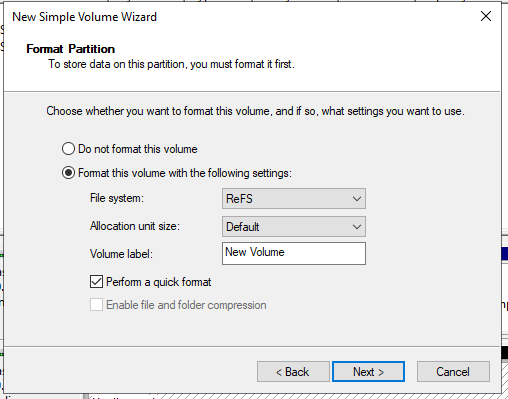  
Make sure to have it as ReFS and not NTFS, click next then finish and see that it formatted:    
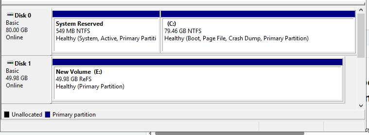    
Then go to Backup Infrastructure -> Backup Repos and click on add repo and choose Direct Attached Storage and if that doesn't work go to the Proxmox instance and create a another linux vm with a data disk of XFS and 1 CPI, 1-2 GB of RAM.   
Click on Create VM and name it veeam-hardened-repo and use the previously downloaded Ubuntu Server and launch it and log in after waiting a while for it to get setup.  
Then after logging in type lsblk:   
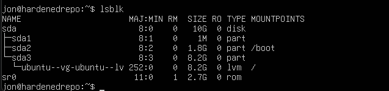  
Then go to Proxmox UI and go to the Hardware tab and click on add and select hard disk, then go back to the new VM and type echo 1 | sudo tee /sys/class/scsi_device/*/device/rescan then lsblk to see this:    
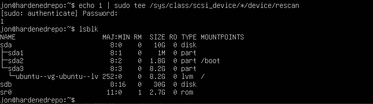    
The new disk showed up so its time to partition and format to XFS by running this command and checking with lsblk:  
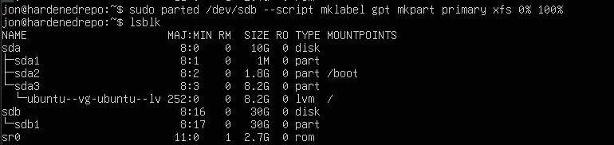    
Then format sdb1 as XFS by running sudo mkfs.xfs /dev/sdb1 like so: 
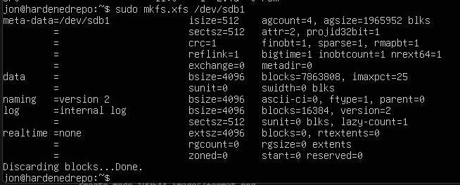    
Then create a mount and mount by running sudo mkdir -p /mnt/veeam-repo and sudo mount /dev/sdb1 /mnt/veeam-repo and then run df -Th /mnt/veeam-repo:    
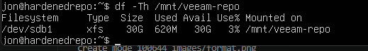    
To make it persistent type sudo blkid /dev/sdb1 to get the UUID, then run this command to add it to /etc/fstab: 
echo "UUID=YOUR-UUID-HERE /mnt/veeam-repo xfs defaults 0 0" | sudo tee -a /etc/fstab    
Then run sudo umount /mnt/veeam-repo, then sudo mount -a, then df -Th /mnt/veeam-repo:  
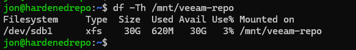    
Now with it mounted, make sure ssh is running by running sudo systemctl status ssh and then ip addr show | grep "inet " which will show its running and showing a healthy IP.   
Then create a user by typing and running sudo adduser veeamrepo and create a password for it.   
Then add veeamrepo to the sudo group by running: sudo usermod -aG sudo veeamrepo then confirm the shell is bash by running getent passwd veeamrepo: 
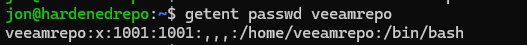    
Then confirm group memberships by running groups veeamrepo: 
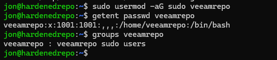   
Then go back to the VBR console in the Windows Server VM on the Linux computer. 
Click on add repo, choose direct attached storage -> Linux, enter the hostname as 10.0.0.85 and enter the root credentials of the hardenedrepo server. Make sure on the hardened repo by allowed PermittedRootLogin and PasswordAuthentication to yes by running:   
echo "PermitRootLogin yes" | sudo tee -a /etc/ssh/sshd_config   
echo "PasswordAuthentication yes" | sudo tee -a /etc/ssh/sshd_config    
sudo systemctl restart ssh  
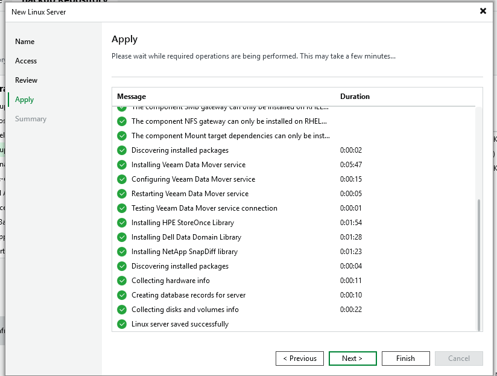  
Then apply and continue and see that the immutable option is available: 
*Make sure that restricted mode is disabled by running sudo /opt/veeam/transport/veeamtransport --is-restricted-mode-enabled*
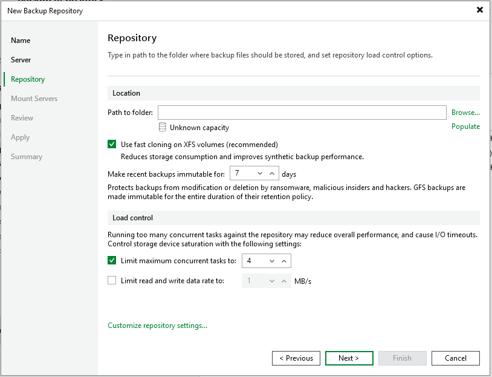    
Then click on browse and see the folder options like so:    
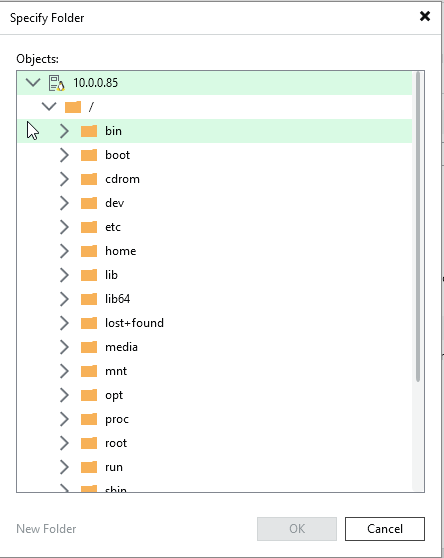    
Expand the /mnt folder and select the veeamrepo folder and then click through for it to apply and finish:   
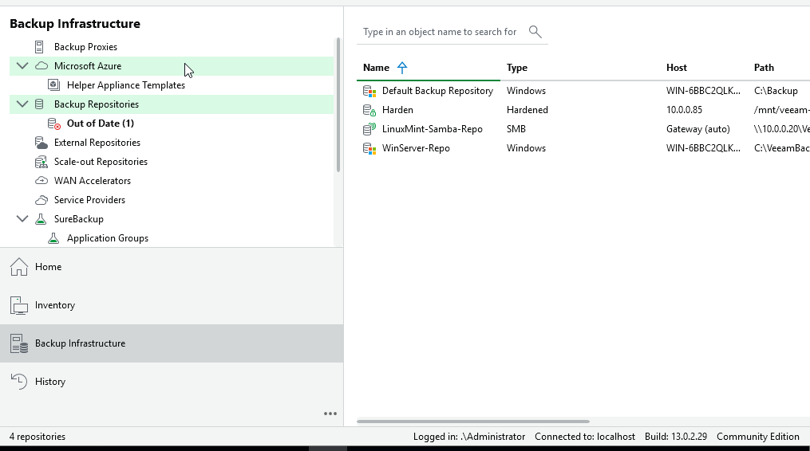  
Then do a test backup by going to backup job like so:   
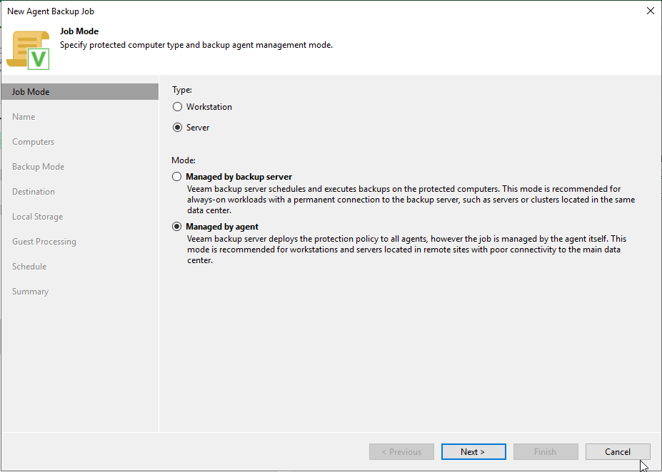    
Then hit continue and get here after clicking on add and clicking on computer:   
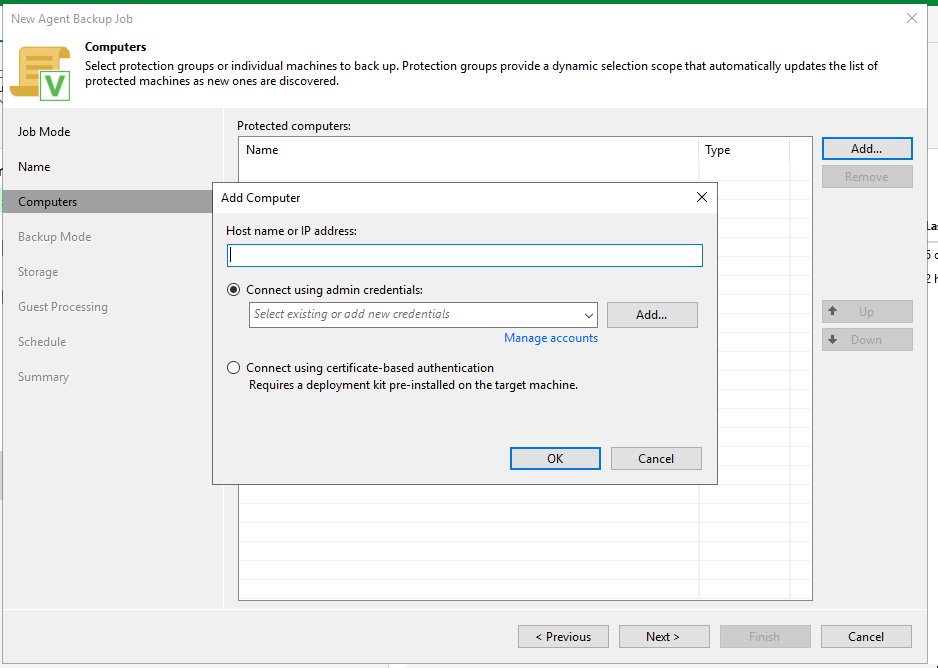  
Enter in the credentials of the test VM such as username and password and see it pop up like so:    
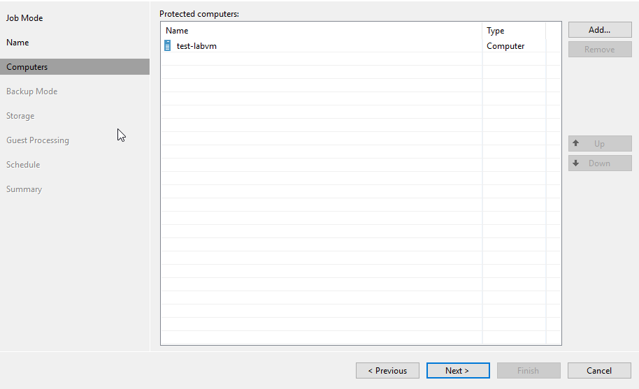    
Then click on next and get here:    
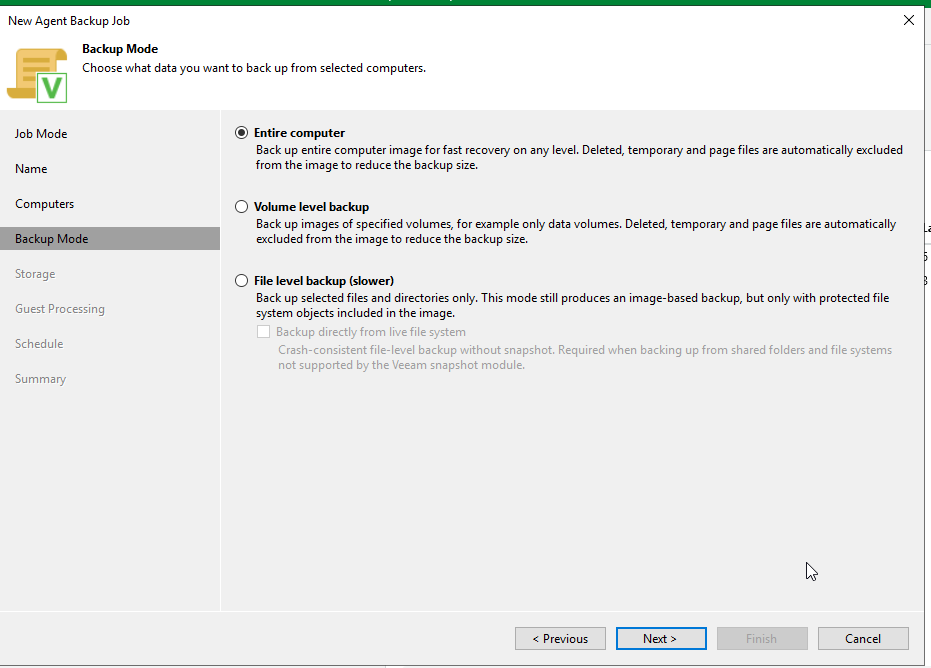  
Leave as is and hit next and get to this screen:    
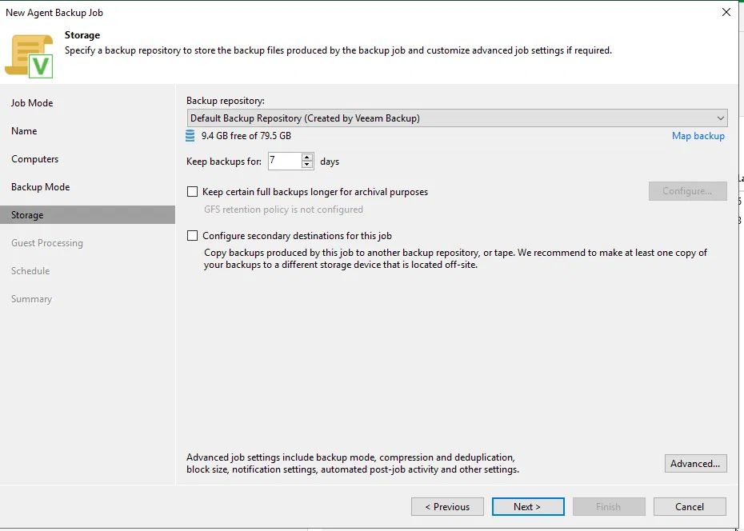   
Then select from the dropdown and select the hardened repo then hit next till summary and see the new job in the backups:   
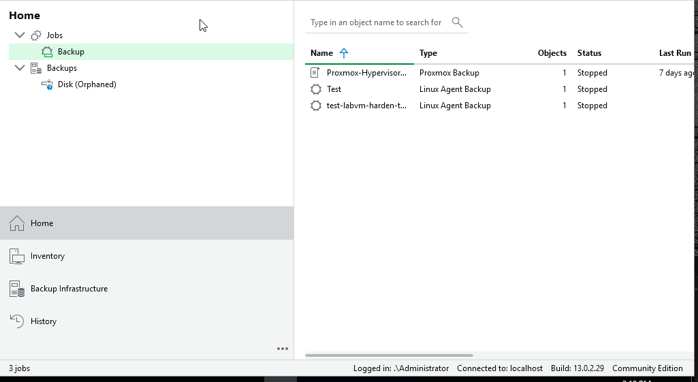  
Then right click on it and click on start and notice after a few minutes:   
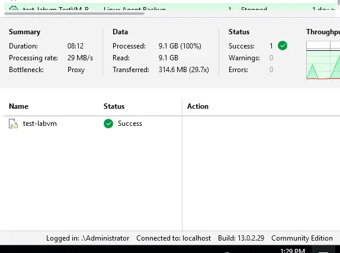 
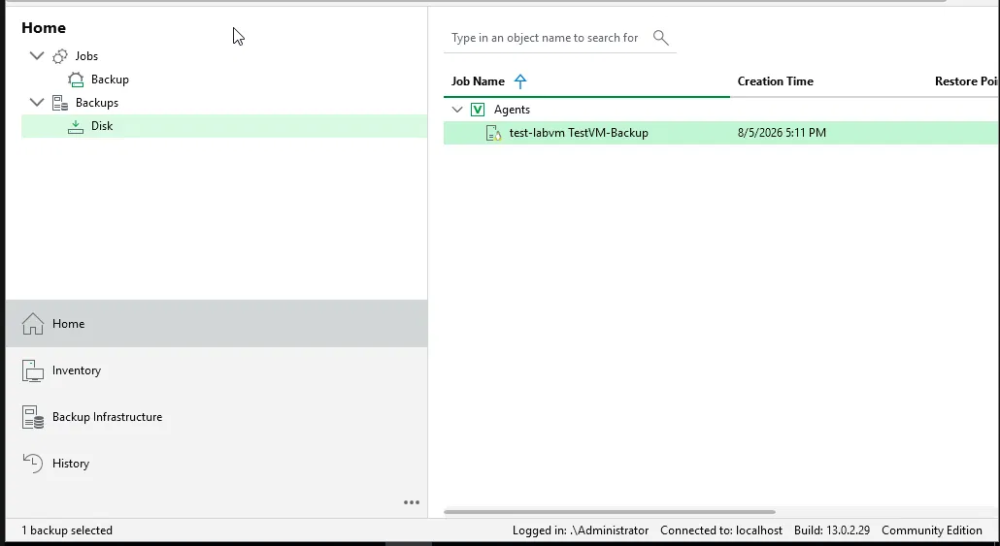 
This shows that the job was successful and immutability is functional

Next its time for RBAC
To establish role based access control, click in the hamburger icon/3 lines in the top left and select Users and Roles: 
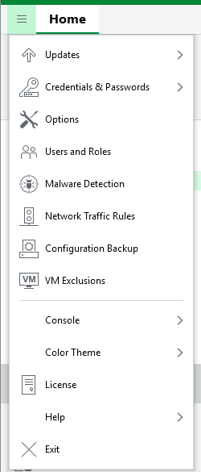  
Then click on it and see a option to roles like so: 
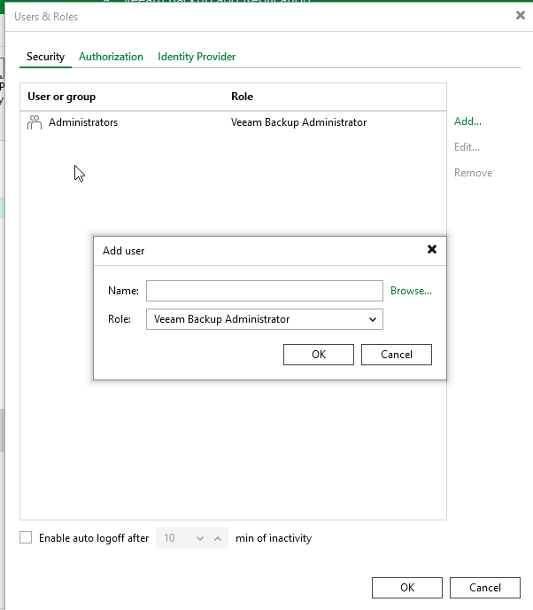  
If you click down, you will see a list of other roles to choose from and add other users to it. For this since there is only one account, this is a good to know.   

# Automation
Automating certain tasks can be useful especially when it comes to disaster recovery.   
Start by clicking on the new backup job and clicking on edit and going to the storage section and checking the Keep backups for period" option and have it set to 7 days to match with immutability.    
Then check the keep certain full backups option and see it no longer greyed out and check the configure option: 
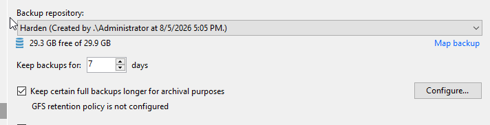  
Then see this and have the first option checked to match the 7 days mark:   
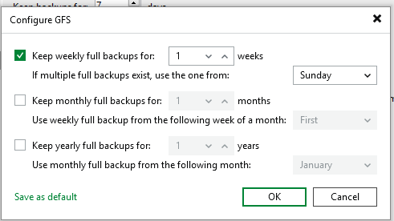    
Then confirm it.    
Next lets move on to storage level corruption health check. Click on the advanced settings on storage and see this: 
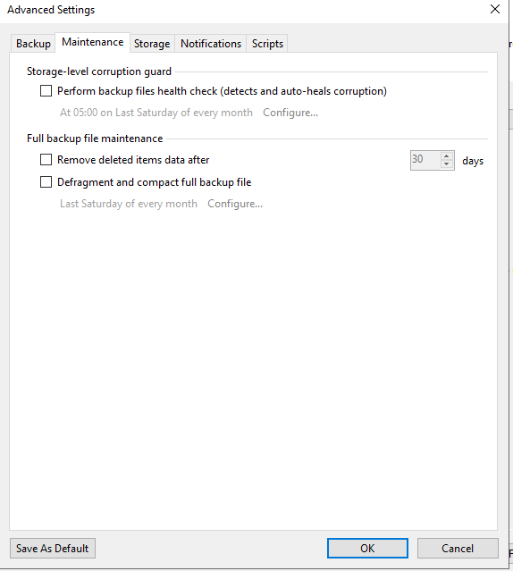    
Check it and also check the defragment option for full backup file maintenance. Then move on to the schedule section and check the first option:    
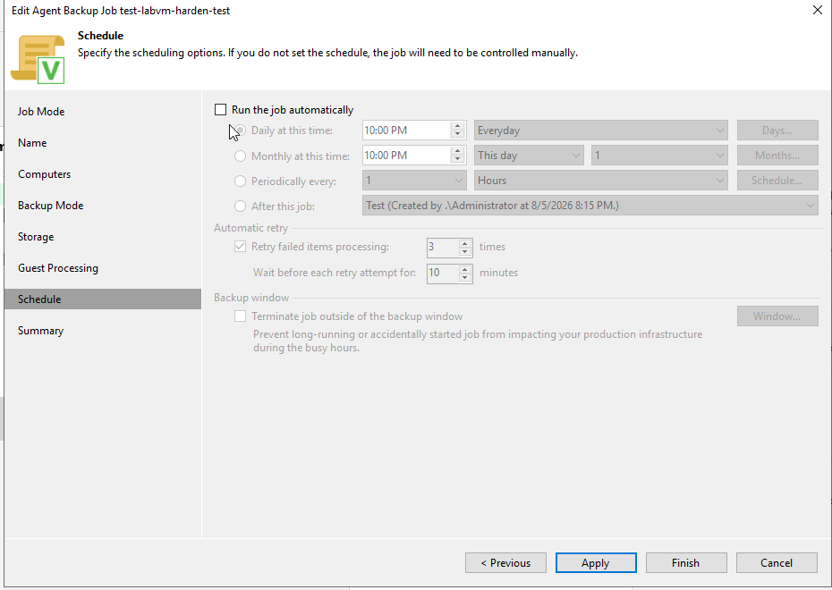    
The hit apply and finish. Then move on to email notifications
Click the hamburger menu and click on options and go to email:  
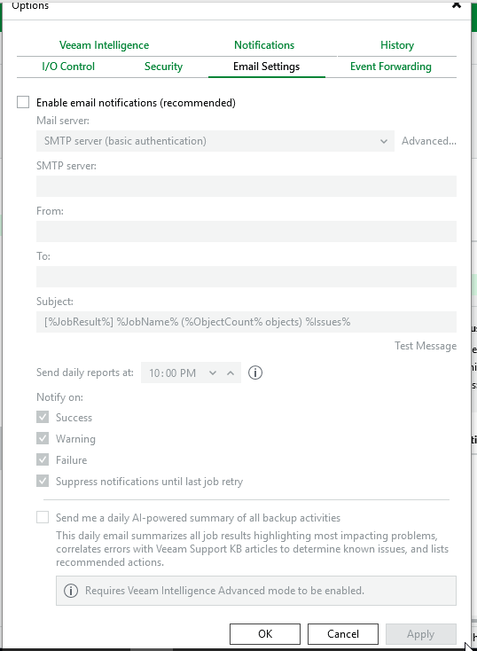    
Keep the gmail server option, fill in the email to and from, and click on advanced. Change the port from 25 to 587 and put the email and apppassword like so:   
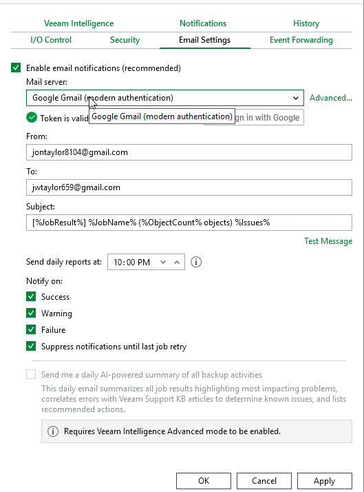    
Then hit the test message option which will send a message to the target:   
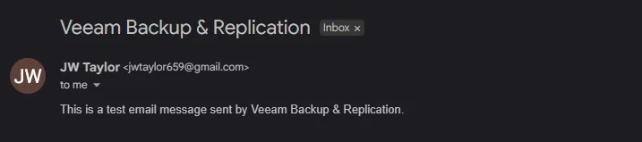   
